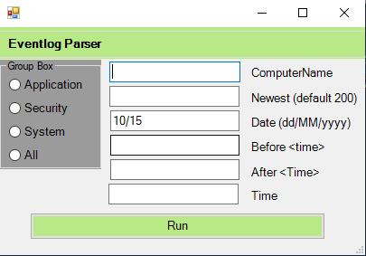

# Powershell-GUI for Event Logs

Eventlog-Gui is a tool for parsing logs from EventViewer and assign filter scopes.
Eventlog cli has the same functions, just runs in powershell cli instead

To fetch and parse windows event logs from local or remote Computer.
If the "all" radio button is selected, it will fetch  the last 200 logs of each log type.
To copy logs from Out-Gridview, select log lines and hit ok or enter. It will copy the text to clipboard.

# Event Log CLI Parser

Same as the gui version, but can print out a more detailed message on the cli with option -o, and copy the output to the clipboard.
If no logname is provided, it will fetch all 3 log types.

SYNTAX

    [log <host> [-newest <number>] [-time <time>] [-logname <logname>] [-date <date>] [-before <time>] [-after <time>] [-o]
    -o : Output to terminal

Example:
    
    Remote: 
        log -ComputerName contoso.local -newest 1000 -time 10:10 -logname system -date 14.10
        log contoso.local -after 10:00 -date '14.10.2020' -o
        
    Local: 
        log -logname system -before 11:00 -after 10:00 -date '14.10.2020'
